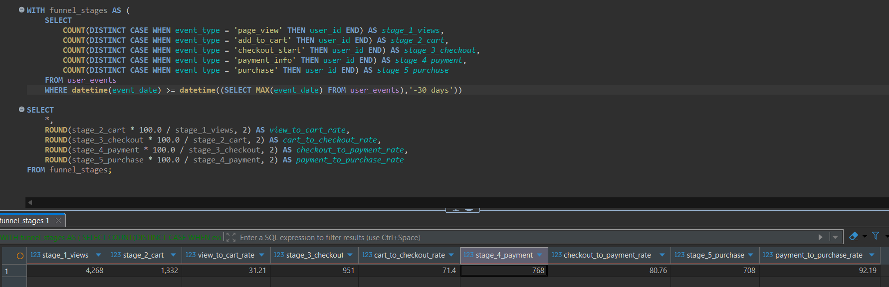
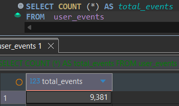
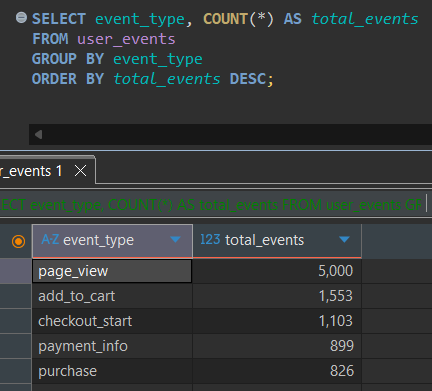
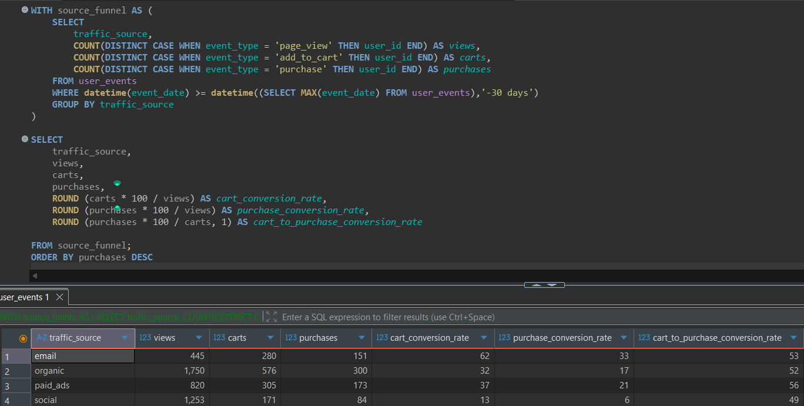
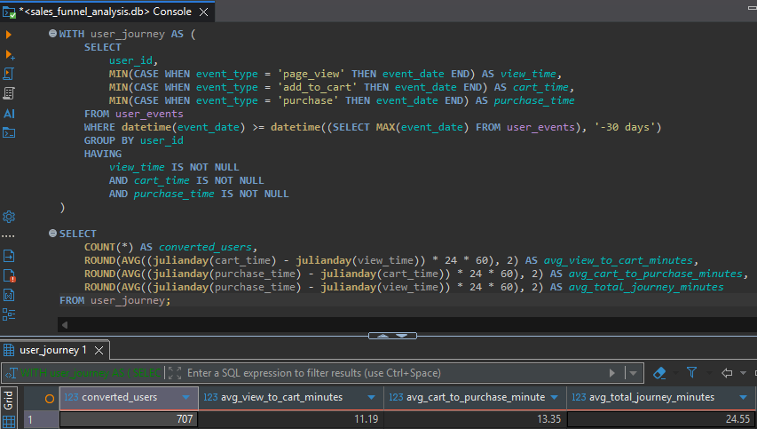
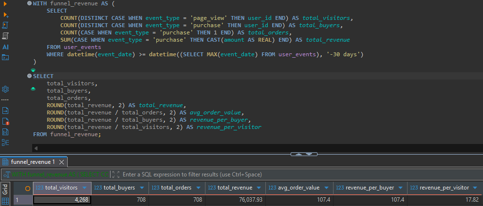

# Sales Funnel Analysis

## Project Overview

This project analyses user behaviour across a sales funnel using SQL. The analysis covers event volume, funnel conversion rates, traffic-source performance, time to conversion, and revenue metrics.

The goal is to understand where users drop off, which traffic sources perform best, how quickly users convert, and how funnel activity connects to revenue.

## Tools Used

- SQLite
- DBeaver
- DB Browser for SQLite
- SQL
- GitHub

## Repository Structure

```text
sales-funnel-analysis/
├── README.md
├── queries/
│   ├── 01_funnel_conversion_analysis.sql
│   ├── 02_event_volume_and_distribution.sql
│   ├── 03_funnel_by_traffic_source.sql
│   ├── 04_time_to_conversion_analysis.sql
│   └── 05_revenue_funnel_analysis.sql
└── images/
    ├── funnel_conversion_results.png
    ├── total_event_count.png
    ├── event_type_distribution.png
    ├── funnel_by_traffic_source_results.png
    ├── time_to_conversion_results.png
    └── revenue_funnel_results.png
```

## Dataset

The dataset contains user event records from a sales funnel. Each row represents a user activity such as page view, add to cart, checkout start, payment information, or purchase.

Main fields include:

- `event_id`
- `user_id`
- `event_type`
- `event_date`
- `product_id`
- `amount`
- `traffic_source`

---

## Example 1: Funnel Conversion Analysis

### Objective

Measure the number of unique users at each funnel stage and calculate the conversion rate between consecutive stages.

### Query

- [View funnel conversion analysis query](queries/01_funnel_conversion_analysis.sql)

### Result




### Key Insight

The largest drop-off occurs between page view and add to cart. Only **31.21%** of users who viewed a page proceeded to add an item to their cart.

---

## Example 2: Event Volume and Distribution

### Objective

Measure the total number of event records and examine how those records are distributed across the different sales-funnel stages.

### Query

- [View event volume and distribution query](queries/02_event_volume_and_distribution.sql)

### Result





### Key Insight

The dataset contains **9,381 event records**. Page views account for the largest share of activity, while event volume decreases at each later funnel stage.

---

## Example 3: Funnel Performance by Traffic Source

### Objective

Compare funnel performance across different traffic sources by measuring views, carts, purchases, and conversion rates.

### Query

- [View funnel by traffic source query](queries/03_funnel_by_traffic_source.sql)

### Result



### Key Insight

Organic traffic produced the highest number of purchases, while email had the strongest conversion performance. Social traffic generated many views but had the weakest conversion rates.

---

## Example 4: Time to Conversion Analysis

### Objective

Measure how long converted users take to move from page view to add to cart and from add to cart to purchase.

### Query

- [View time to conversion analysis query](queries/04_time_to_conversion_analysis.sql)

### Result



### Key Insight

Converted users completed the full journey from page view to purchase in an average of **24.55 minutes**.

---

## Example 5: Revenue Funnel Analysis

### Objective

Analyse revenue performance by calculating total visitors, buyers, orders, revenue, average order value, revenue per buyer, and revenue per visitor.

### Query

- [View revenue funnel analysis query](queries/05_revenue_funnel_analysis.sql)

### Result



### Key Insight

The funnel generated **76,037.93** in total revenue from **708 orders**. The average order value was **107.40**, while revenue per visitor was **17.82**.

---

## Project Limitations

This project uses practice data for learning purposes. The recommendations are based on the available event-level dataset and should be treated as sample business analysis rather than conclusions from a real company.

## Final Recommendations

Based on the analysis, the main issue is not the checkout process but the earlier funnel stage. The largest drop-off occurs between page view and add to cart, so product page engagement should be prioritised.

Email and organic traffic should be strengthened because they show strong performance. Social traffic should be reviewed carefully because it generates many views but weaker conversion rates.

The checkout and payment flow appears relatively strong, so major changes to that stage may not be necessary. Improving visitor-to-cart conversion and strengthening high-performing traffic sources would likely have the greatest impact on overall revenue.

## Key Learning Summary

Through this project, I practised:

- Writing SQL queries using `COUNT`, `SUM`, `CASE WHEN`, and `GROUP BY`
- Using Common Table Expressions
- Calculating conversion rates
- Analysing user behaviour by traffic source
- Working with timestamp data using `julianday()`
- Connecting funnel activity with revenue metrics
- Documenting SQL analysis clearly for GitHub
